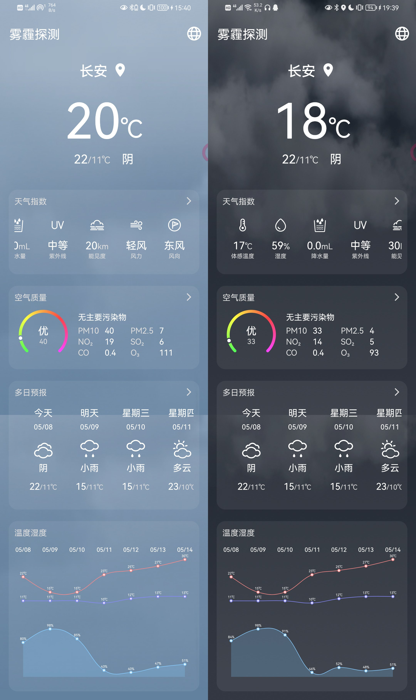

# HazeDetect

西电B测雾霾探测APP

## 界面截图

## 介绍

这是一个查询当日天气状况的APP，天气信息和城市查询均使用[和风天气API](https://dev.qweather.com/docs/api/)。界面的设计参考了华为天气APP。

## 功能实现

* 定位：实现了从经纬度选定对应的城市。
* 城市模糊查询：可以根据关键字或拼音查询提供待选城市列表。
* 天气信息显示：支持显示天气指数、空气质量、多日预报等数据。
* 背景切换/粒子效果：根据当前天气自动更换背景，在雨雪天气渲染合适的粒子效果。

## 项目部署

在Release中下载文件，其中app-release.apk是APP的发布版本，server.py是服务器端脚本。

如需要在本地测试，请先确保服务器端（电脑）与客户端（安卓设备）在同一网络环境下。先使用Python运行server.py，当显示`Running on http://[IP地址]:[端口号]`时即为运行成功。此时打开APP，点击右上角的网络图标，在对话框中输入对应的地址和端口号，点击确定。随后点击选择城市，点击右下角的定位按钮（如果要求定位权限，点击允许即可），如果服务器运行正常，稍等片刻即可自动返回并显示天气状况。

